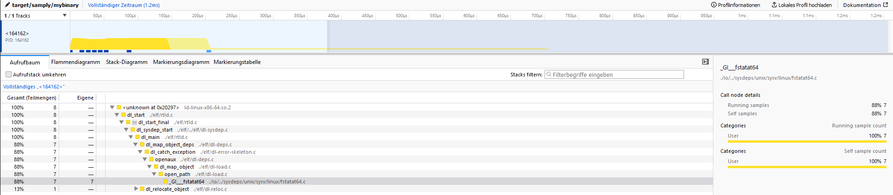

# Cargo Samply

a simple integration binary that automates the process of running cargo build with a certain profile and samply afterwards.

## installation

for now you can install it via

```bash
cargo install --git https://github.com/PhilippPolterauer/cargo-samply.git
```

## Example Usage

```console
$ cargo new mybinary
$ cd mybinary
$ cargo samply
cargo.toml: ~/rust/mybinary/Cargo.toml
'samply' profile was added to 'Cargo.toml'
   Compiling mybinary v0.1.0 (~/rust/mybinary)
    Finished samply [optimized + debuginfo] target(s) in 0.18s
Hello, world!
Local server listening at http://127.0.0.1:3001
```

when opening the server address (127.0.0.1:3001) the output should look like the following.

